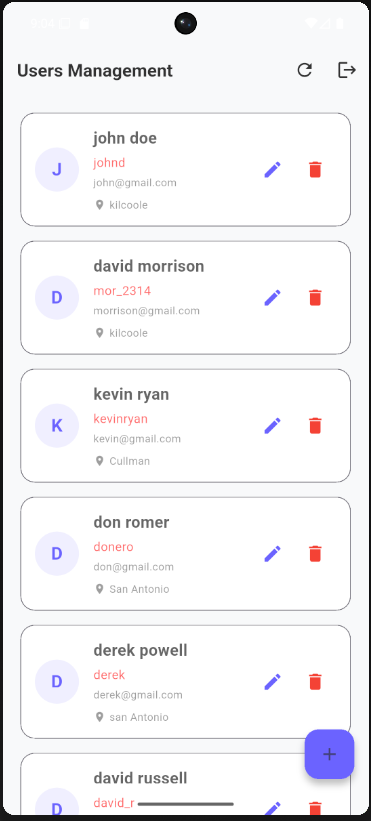
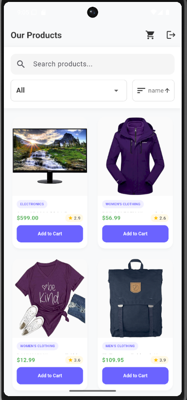

# Lab 10 – Flutter E-Commerce App

จัดทำโดย: Woravit Suwan  
รหัสนักศึกษา: 67543210064-1

---

## อธิบายโปรเจกต์ (Project Overview)

โปรเจกต์นี้เป็นแอปพลิเคชัน E-Commerce ที่พัฒนาด้วย Flutter โดยจำลองการดึงข้อมูลสินค้าจาก API ของ fakestoreapi.com เพื่อแสดงรายการสินค้าในแอปพลิเคชัน ผู้ใช้สามารถค้นหา กรอง และจัดเรียงสินค้าได้ พร้อมทั้งเพิ่มสินค้าเข้าสู่ตะกร้า

แอปพลิเคชันถูกออกแบบตามแนวทาง Material Design และมีการจัดการ State Management ด้วย Provider

---

## ฟีเจอร์หลัก (Key Features)

- ระบบ Login (Admin / User)
- แสดงรายการสินค้าแบบ Grid
- ระบบค้นหาสินค้า
- ระบบกรองสินค้า (Category Filter)
- ระบบจัดเรียงสินค้า (Sorting)
- ระบบตะกร้าสินค้า (Shopping Cart)
- Animation ตอนโหลดสินค้า

---

## Screenshots

### Login Page

### User List

### Product List

---

## Tech Stack

- Flutter
- Dart
- Provider (State Management)
- REST API

---

## API Source

https://fakestoreapi.com
