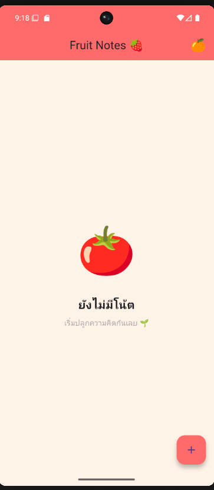
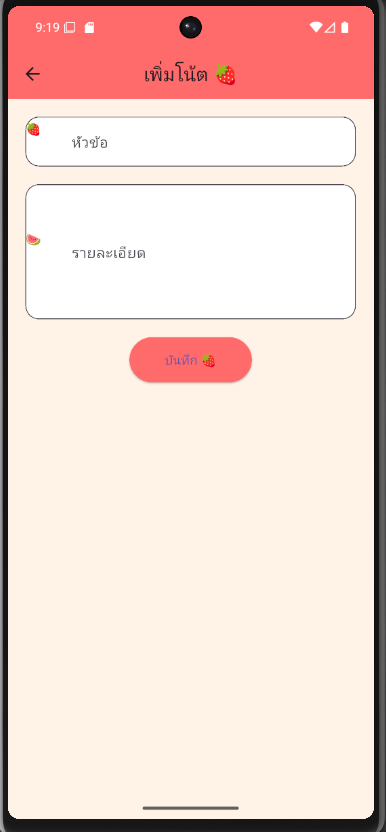

# Lab 11 – Flutter SQLite Application

จัดทำโดย: Woravit Suwan  
รหัสนักศึกษา: 67543210064-1

---

## อธิบายโปรเจกต์ (Project Overview)

โปรเจกต์นี้เป็นแอปพลิเคชันที่พัฒนาด้วย Flutter โดยใช้ฐานข้อมูล SQLite สำหรับจัดเก็บข้อมูลภายในเครื่องของผู้ใช้ แอปพลิเคชันสามารถเพิ่ม แก้ไข ลบ และแสดงข้อมูลได้แบบ Local Database โดยไม่ต้องเชื่อมต่ออินเทอร์เน็ต

การพัฒนาโปรเจกต์นี้ช่วยให้เข้าใจการทำงานของ Local Database ใน Flutter รวมถึงการจัดการข้อมูลภายในแอปพลิเคชันผ่าน SQLite

---

## ฟีเจอร์หลัก (Key Features)

### Add Data
ผู้ใช้สามารถเพิ่มข้อมูลใหม่เข้าสู่ฐานข้อมูล SQLite ได้

### Display Data
แสดงรายการข้อมูลทั้งหมดที่ถูกบันทึกไว้ในฐานข้อมูล

### Update Data
สามารถแก้ไขข้อมูลที่มีอยู่ในระบบได้

### Delete Data
สามารถลบข้อมูลออกจากฐานข้อมูลได้

### Local Database
ใช้ SQLite เพื่อจัดเก็บข้อมูลภายในเครื่อง

---

## Screenshots

### Main Page

### Data Management Page

---

## Tech Stack

- Flutter
- Dart
- SQLite Database
- sqflite package
