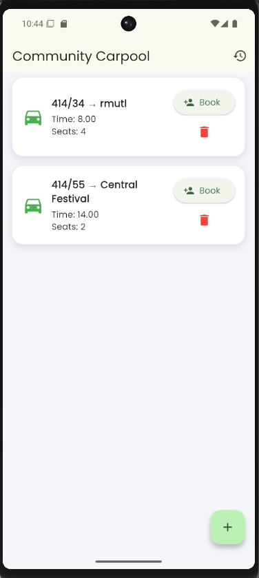
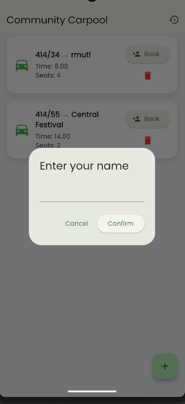

# Lab 12 – Community Carpool Flutter Application

จัดทำโดย: **Woravit Suwan**  
รหัสนักศึกษา: **67543210064-1**

---

## อธิบายโปรเจกต์ (Project Overview)

โปรเจกต์นี้เป็นแอปพลิเคชัน **Community Carpool** ที่พัฒนาด้วย Flutter โดยมีวัตถุประสงค์เพื่อให้สมาชิกในชุมชนสามารถแชร์การเดินทางร่วมกันได้ เช่น การเดินทางไปมหาวิทยาลัย ตลาด หรือสถานที่ทำงาน

แอปพลิเคชันนี้ใช้ **SQLite Local Database** สำหรับจัดเก็บข้อมูลการเดินทางภายในเครื่องของผู้ใช้ และใช้ **Provider State Management** เพื่อจัดการข้อมูลภายในแอปพลิเคชัน

ผู้ใช้สามารถเพิ่มการเดินทางใหม่ ดูรายการรถที่มีอยู่ จองที่นั่ง และลบรายการได้ โดยข้อมูลทั้งหมดจะถูกจัดเก็บแบบ Local Database โดยไม่ต้องเชื่อมต่ออินเทอร์เน็ต

---

## ฟีเจอร์หลัก (Key Features)

### Add Ride
ผู้ใช้สามารถเพิ่มข้อมูลการเดินทางใหม่ เช่น

- จุดเริ่มต้น (From)
- ปลายทาง (To)
- เวลาเดินทาง
- จำนวนที่นั่ง

### Display Ride List
แสดงรายการการเดินทางทั้งหมดที่ถูกบันทึกไว้ในฐานข้อมูล SQLite

### Book Seat
ผู้ใช้สามารถจองที่นั่งในรถได้ โดยกรอกชื่อผู้จอง ระบบจะลดจำนวนที่นั่งลงอัตโนมัติ

### Delete Ride
ผู้ใช้สามารถลบรายการการเดินทางออกจากระบบได้

### Local Database
ใช้ **SQLite** สำหรับจัดเก็บข้อมูลภายในเครื่องของผู้ใช้

---

## Screenshots

### Home Page
แสดงรายการการเดินทางทั้งหมดที่สามารถจองได้





---

## Tech Stack

- Flutter
- Dart
- SQLite Database
- sqflite package
- Provider (State Management)

---

## Project Structure

```
lib
│
├ main.dart
│
├ models
│   ride.dart
│
├ database
│   db_helper.dart
│
├ providers
│   ride_provider.dart
│
├ screens
│   home_screen.dart
│   add_ride_screen.dart
│
└ widgets
    ride_card.dart
```

---

## Learning Outcomes

จากการทำ Lab นี้ทำให้ได้เรียนรู้

- การพัฒนา Mobile Application ด้วย Flutter
- การจัดการ State ของแอปด้วย Provider
- การใช้งาน SQLite สำหรับ Local Database
- การสร้างระบบ CRUD ภายในแอปพลิเคชัน
- การออกแบบ UI สำหรับแอปพลิเคชันมือถือ
