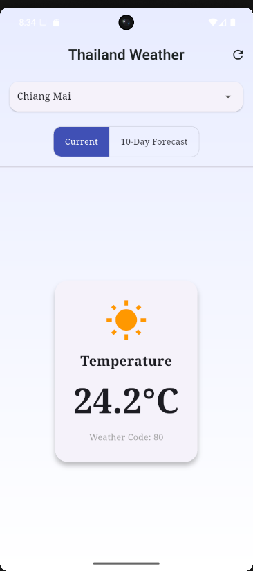
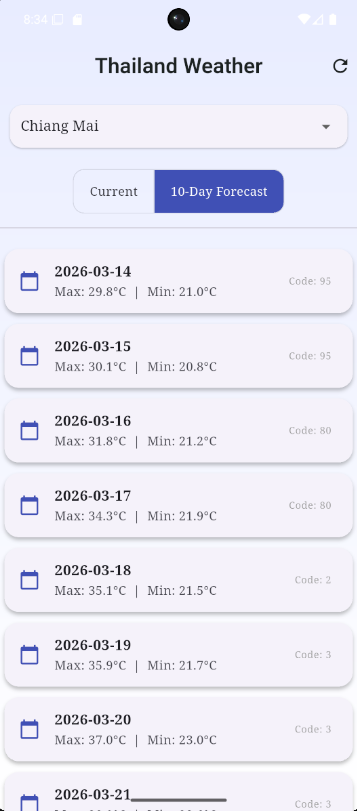

# Lab 9 – Thailand Weather App

แอปพลิเคชันแสดงข้อมูลสภาพอากาศที่พัฒนาด้วย Flutter  
สามารถดูอุณหภูมิปัจจุบันและพยากรณ์อากาศล่วงหน้าได้

---

## Features

- แสดงอุณหภูมิปัจจุบันของเมืองที่เลือก
- แสดงข้อมูลพยากรณ์อากาศ
- สามารถเปลี่ยนเมืองเพื่อดูข้อมูลได้
- แสดงข้อมูลสภาพอากาศจาก Weather API

---

## Tech Stack

- Flutter Framework
- Dart Programming Language
- Material Design UI
- HTTP API

---

## Weather API

ข้อมูลสภาพอากาศดึงมาจากบริการ API ภายนอก เช่น

- OpenWeather API

---

## Screenshots

### Current Weather

### Forecast

---

## Project Structure
